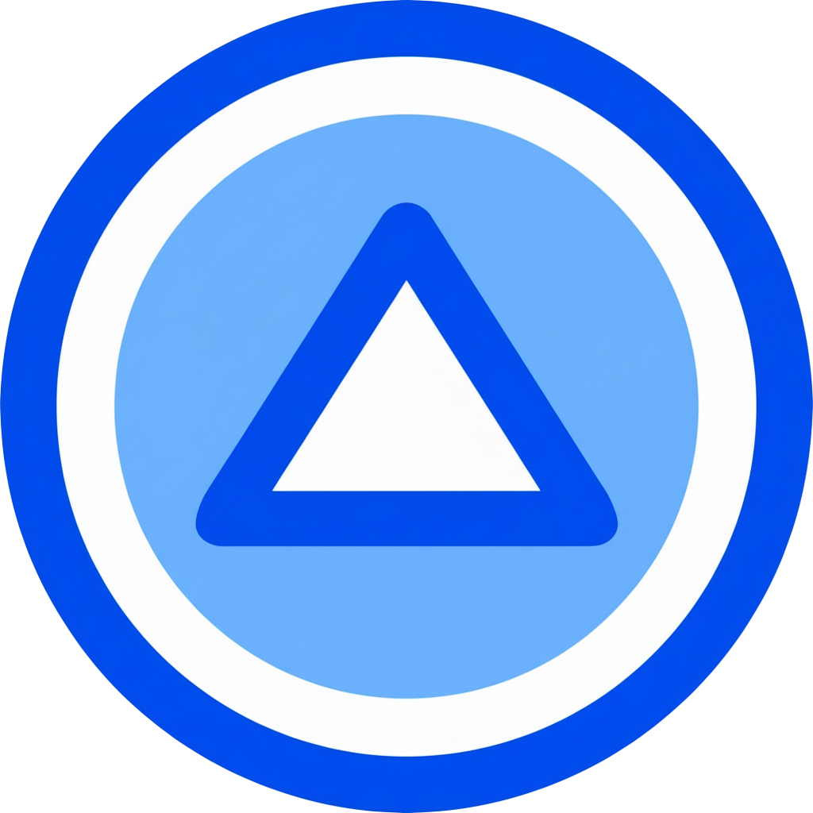

# Docstree 

Docstree is a Manifest V3 browser extension that signs in with Google and shows your Drive (My Drive and Shared Drives) as a clean, collapsible tree. It is built with React and Plasmo for quick iteration and open-source contributions.

## What it’s for
- Quickly browse Google Drive folders/files without opening drive.google.com
- Jump straight to a file or folder via the tree links
- Keep a lightweight set of favorites for frequent locations
- Stay in a privacy-first client: no backend, tokens remain in the browser

## Features
- Google OAuth with `identity` + Drive read-only scope; sign-in/out from the popup
- Toggle between My Drive and available Shared Drives; remembers the last selection
- Live tree view with search filter, item counts, and per-item favorites
- Light/dark theme toggle; preference stored locally
- Favorites tab built from your starred nodes; persisted locally
- Links open in a new tab directly to the Drive item

## Requirements
- Node.js 18+
- A package manager (`pnpm`, `npm`, or `yarn`)
- Chrome/Edge/Firefox with extension developer mode enabled
- A Google Cloud OAuth client ID for the extension (no client secret is stored or required)

## Quick start (development)
1. Install dependencies:
   ```bash
   pnpm install    # or npm install / yarn install
   ```
2. Run the dev build:
   ```bash
   pnpm dev        # or npm run dev / yarn dev
   ```
3. Load the unpacked build:
- Chrome/Edge: open `chrome://extensions` (or `edge://extensions`), enable **Developer mode**, click **Load unpacked**, and select `build/chrome-mv3-dev`.
- Firefox: open `about:debugging#/runtime/this-firefox`, click **Load Temporary Add-on**, and select `build/firefox-mv3-dev/manifest.json`.

More detail: `docs/getting-started.md`.

## Environment variables
- Copy `.env.example` to `.env.local` (or `.env`) and set `PLASMO_PUBLIC_GOOGLE_CLIENT_ID=...`.
- Only `PLASMO_PUBLIC_*` vars are exposed to the client bundle; keep anything sensitive out of the extension entirely.
- `.env` is gitignored; `.env.example` shows required keys for contributors.

## Google Drive setup (OAuth)
- Enable the **Google Drive API** in your Cloud project.
- Create an OAuth client for the extension and set the redirect to `https://<EXTENSION_ID>.chromiumapp.org/`.
- Place your client ID in `.env.local` via `PLASMO_PUBLIC_GOOGLE_CLIENT_ID`. No client secret is needed in the extension code.
- Keep OAuth JSON secrets out of source control when publishing.

Full walkthrough: `docs/google-drive-setup.md`.

## Usage
- Open the extension popup → **Sign in with Google**.
- Choose a root: **My Drive**, a Shared Drive, or **Favorites** (appears after you star something).
- Use the search box to filter the tree; click a row to open the Drive link in a new tab.
- Star/unstar nodes to build your favorites list; theme toggle lives in the popup menu.

## Build for release
```bash
pnpm build    # or npm run build / yarn build
```
Outputs production bundles in `build/<browser>-mv3-prod`, ready to zip and submit to extension stores. `pnpm package` can also produce zipped artifacts.

## Project structure
- `popup.tsx` — main UI (tree rendering, search, favorites, theming, auth state)
- `lib/googleAuth.ts` — Google OAuth via `chrome.identity`
- `lib/googleDrive.ts` — Drive API calls (files and shared drives)
- `styles/*` + `tailwind.config.js` — theme tokens and Tailwind setup
- `docs/*` — setup guides for development and Drive/OAuth configuration

## Privacy & data
- Docstree is client-side only; it calls Google APIs directly from the browser.
- Access token and preferences (selected drive, theme, favorites) are stored locally (`chrome.storage`/`localStorage`).
- Scope is limited to `drive.readonly` by default; broaden only if you need additional capabilities.
- Do not commit private OAuth JSON files (e.g., `secrets/*.json`) when publishing the project.
